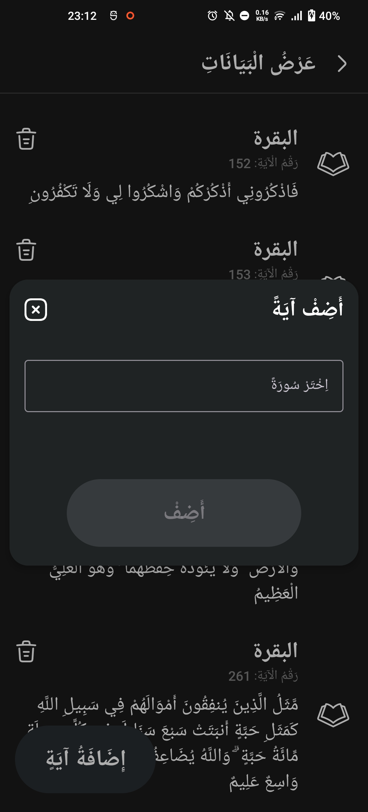

# Random Ayah Generator

An Android application that allows users to bookmark and generate random Quranic verses (Ayahs). It features a built-in Quran database, bookmarking functionality, playback count tracking, and a dashboard for viewing statistics. The app supports both light and dark modes.

## Features

### Random ayah generation

Generates random pairs of Ayahs from the bookmarked Ayahs.  
 
 

### Bookmark ayahs

Allows users to manually add and bookmark Ayahs, either individually or entire Surahs.  
 

### Add complete surah

Easily bookmark all Ayahs from a selected Surah.  
 

### View bookmarked ayahs

Scrollable list with infinite scrolling to view all bookmarked Ayahs.  
 

### Delete bookmarked ayahs

Delete individual Ayahs from bookmarks with confirmation.  
 

### Dashboard

Displays statistics like the most played Ayahs, most played Surahs, and total play count.  
 
 

### 📂 Navigation drawer

Facilitates smooth navigation between different activities.  
 

### 🗄️ Database management

- **Save Database:** Export the bookmarked Ayahs database to a file.  
- **Load Database:** Import a previously saved database, replacing the current bookmarks.  
- **Delete All Data:** Clear all bookmarked Ayahs.

## ⚙️ Setup and usage

1. **Clone the repository:**

   ```bash
   git clone git@github.com:ImadSaddik/RandomAyahGenerator.git
   ```

2. **Open the project in Android Studio.**

3. **Build and run the application** on an emulator or physical device.

## 📚 Key concepts

I learned a lot while working on this project. First, I made wireframes for each part of the app before writing any code. This helped me see how the app would look and made it easier to build in Android Studio.  

From the start, I designed the app to support both light and dark modes. When I switched themes, I also figured out how to use state management to reload data that got lost during the switch.  

I learned how to manage SQLite databases, create navigation drawers, and use infinite scrolling to go through the stored data smoothly.  
